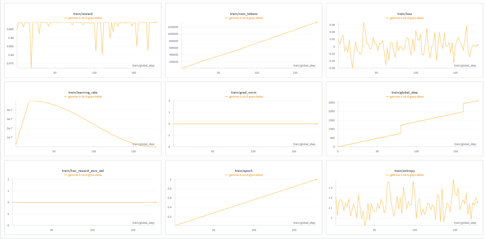
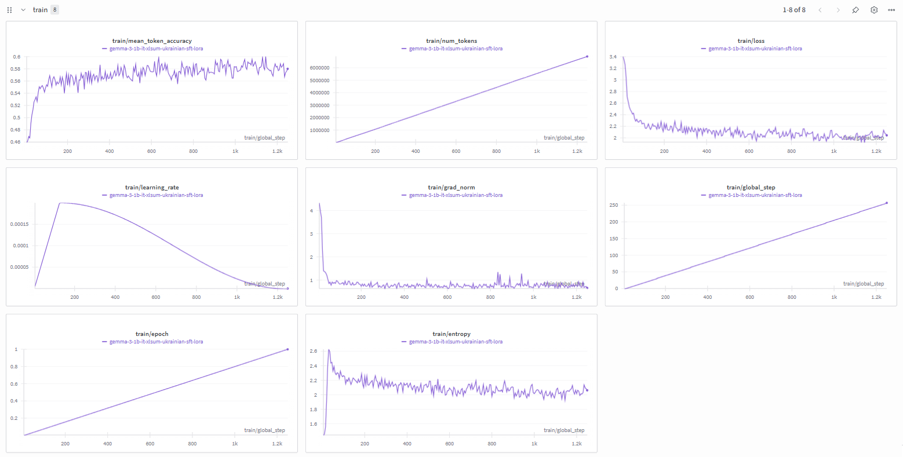
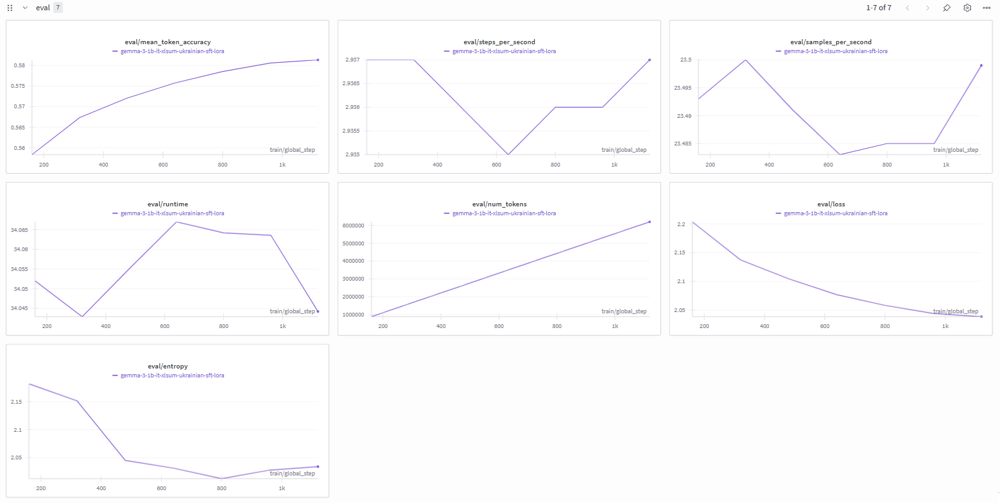

VM: google colab instance

OS: Ubuntu 22.04 LTS 
CPU: Intel Xeon 
GPU: NVIDIA A100 80GB

#######################################################################################

Пайплайн:

1. робота з даними:
завантаження датасету XLSum (ukranian subset). Генерація датасету токсичних новин на основі початкового. Генерація проводилась на основі моделі gemma3-4b-it та зачистки некоректних прикладів алгоримтічно (входження підрядків "user", "model", "```")

2. SFT via LoRA моделі gemma3-1b-it з наступним мерджем адаптера та вагів моделі.

3. GRPO моделі gemma3-1b-it-sft на основі токстичного датасету. 

4. Evaluation (rouge, toxicity score) для всіх навчених моделей.

#######################################################################################
Пояснення прийнятих рішень:


-генерація датасету токсичних новин для того, щоб модель виконувала реальну задачу сумаризації навіть під час GRPO (датасетів токсичних новин я не знайшов).

-gemma3-1b-it обарана як модель, яка у своєму base варіанті краще всього обробляє українську

-В reward function була не лише модель-класифікатор, але й було додано вплив Rouge, аби модель пам'ятала про задачу сумаризації, тож reward_function = 0.7*(1-toxicity_score) + 0.3*rouge_score

-sft проводилось на сабсеті XLSum (10_000), бо я не міг забезпечити достатньо часу для виконання навчання

-lora було використано для оптимізації швидкості навчання (повний файн-тюн потребував набагато більше часу і compute, якого в мене майже не лишилось у google colab)

-evaluation проводилось на токсичному тестовому датасеті сумаризації, аби можна було об'єктивно заміряти і токсік скор, і самаризацію. Додано максимальний токсік скор на датасеті, бо він дуже яскраво відображає різницю між моделями

#######################################################################################
Як запускати:

python scripts/entry_point.py --full


Це entry point для запуску всього пайплайну тренування. Запускати з командного рядка з флагами: --full для повного пайплайну (підготовка даних → SFT → GRPO → оцінка), або --stages data sft grpo eval для вибіркового запуску етапів. Можна пропускати етапи через --skip-sft або --skip-grpo. Для примусової регенерації даних використовуйте --force-regenerate-toxic. Всі налаштування беруться з config/config.yaml, але можна вказати свій через --config. Логи пишуться в консоль і в pipeline.log. Приклад: python scripts/entry_point.py --full --skip-evaluation запустить все окрім оцінки.


Я запускав через ноутбук entry_point_as_google_colab.ipynb.

завантажував цей архів на свій гугл диск, ноутбук відкривав через колаб, вивбирав інстанс А100 і запускав всі клітинки поспіль. 

Через uv та scripts/entry_point.py тежмає працювати, але я його не протестував (нема на чому)

#######################################################################################
Результати, їх аналіз, потенційні проблеми та покращення:




результати навчання:

| model_name | model_path | rouge1 | rouge2 | rougeL | rougeLsum | max_toxicity | mean_toxicity | num_samples |
|:---|:---|:---:|:---:|:---:|:---:|:---:|:---:|:---:|
| base | google/gemma-3-1b-it | 0.053820 | 0.012687 | 0.050800 | 0.050779 | 0.276903 | 0.008074 | 134 |
| sft | models/sft_final | 0.044492 | 0.022388 | 0.044421 | 0.042786 | 0.400643 | 0.006566 | 134 |
| grpo | models/grpo_final | 0.063806 | 0.022388 | 0.062687 | 0.062687 | 0.173477 | 0.006231 | 134 |

Аналіз результату:

Метрики: 

ROUGE - чим більше, тим краще 

токсік скор - чим менше, тим краще


Модель grpo (grpo_final) є найкращою: вона демонструє найвищі показники якості ROUGE-1, ROUGE-L та ROUGE-Lsum, а також є найбезпечнішою (найнижча середня та максимальна токсичність). Модель sft (sft_final) має найкращий ROUGE-2 (нарівні з grpo), але найнижчий ROUGE-1 та найвищу максимальну токсичність (0.400643). Базова модель (base) має найвищу середню токсичність (0.008074).

Мінуси: 
-на кожному етапі використовувалось дуже мало даних. Треба більше, але все впиралось у час неперервної сесії та compute.

-інстанс з А100: gemma оптимізована для TPU, у той час як використання оптимального на GPU flash attention (1/2/3) робить модель непередбачуваною у поведінці, що повпливало на швидкість навчання в тому числі.

-LoRA, а не повний файн-тюн -- теоретично, сходимість слабша (треба більше даних), можуть бути проблеми з підбором параметрів (я не підбирав оптимальні ранг, lr та інші. треба було ставити більше експериментів)

-взагалі підбір гіперпараметрів

-більш якісна перевірка токсичних датасетів (вони очищені не ідеально, можна було б пошаманити над ними більше та банально взяти більш модель для його генерації, аби вийшли більш адекватні приклади)

-мало тестових прикладів: частина попередньої проблеми, але фактично метрики дуже шумні, аби дійсно отримати більш об'єктивну оцінку, треба більше точок тестових даних

-messy .py файли. Можна було б написати їх краще, для evaluation та data generation використовувати infernce frameworks (vllm etc.).

-відтворюваність (не запускав через uv та scripts/entry_point.py, а не через google colab), тому не можу гарантувати що це 100% працюватиме


